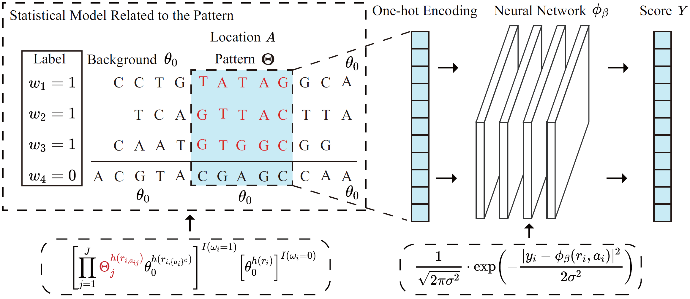

# Deep Probabilistic Sequence Model
This is a probabilistic deep learning framework that integrates interpretable motif discovery with flexible nonlinear prediction. It combines a statistical model with a deep neural network. 

The statistical model on the left identifies functional sequence patterns (motifs) within biological sequences. Each sequence is assigned a latent variable $\omega$ indicating the presence (or absence) of a functional motif. The position matrix $A$ pinpoints locations of functional motifs(red residues). Residues inside the functional motifs are sampled from a motif-specific distribution $\Theta$, while residues outside the motif region are drawn from a background distribution $\theta_0$. In the neural network,the residues identified by the position matrix(highlighted in blue) is one-hot encoded to convert the categorical sequence data into a numerical format. The input is processed by a deep neural network $\phi_\beta$, which predicts the quantitative outcome score $Y$.

* data source: https://services.healthtech.dtu.dk/suppl/immunology/NAR_NetMHCpan_NetMHCIIpan/

* python ver --3.11.4

* packages --requirements.txt
